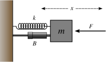
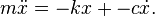

Experimental Bode Plots
=======================

It's trivial to create a Bode Plot if you have a transfer function -- but what if you just have experimental data at various frequencies?

Consider the Mass-Spring-Damper system:

(read more at [Wikipedia: Mass-Spring-Damper](http://en.wikipedia.org/wiki/Damping#Example:_mass.E2.80.93spring.E2.80.93damper))

If you think of the force, F, as the input, and the displacement, x, as in the output, and then drive the system at various frequencies (that is, apply sinusoidal forces at various frequencies), then you can use FFT to generate a Bode Plot that shows the response of x given F.

To run, open up the massSpringDamper.slx file and run. Code to convert experimental data to a Bode Plot is in massSpringDamper_stop.m

In order to increase the "resolution" of the Bode Plot, you can increase the length of the experiment. This will mean more data points at each frequency, and thus more data points to create the plot. For example, try changing experimentStopTime from 60 to 180 and see the results.
